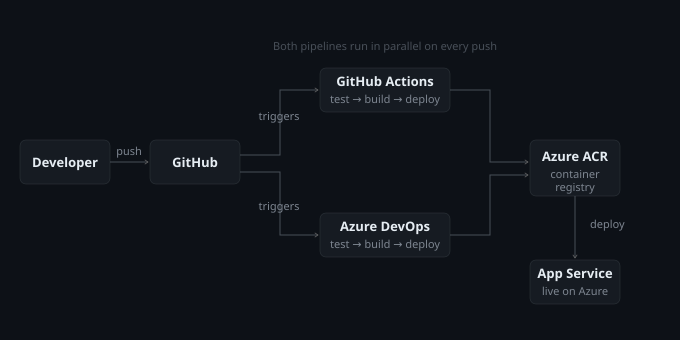

# DevOps Status Monitor

A real-time monitoring dashboard that tracks whether major cloud and DevOps platforms are up and responding fast enough — deployed on Azure with full CI/CD automation.

🔗 **Live:** https://health-monitor-dev.azurewebsites.net



---

## What it does

The dashboard sends real HTTP requests to 6 services every 10 seconds and measures actual response times from Azure's servers. If a service responds slower than its threshold, it shows as degraded. If it's unreachable, it shows as down. The data is real — not simulated.

Services monitored:

| Service | Threshold | Why this threshold |
|---|---|---|
| GitHub | 600ms | Source code and CI/CD dependency |
| Docker Hub | 800ms | Container image pulls can be slower |
| Azure Cloud | 800ms | Large platform, some latency expected |
| Cloudflare | 300ms | Built for speed — should always be fast |
| Google Cloud | 700ms | Competitor cloud benchmark |
| AWS | 700ms | Competitor cloud benchmark |

---

## Tech stack

- **Backend** — FastAPI (Python)
- **Frontend** — HTML, CSS, JavaScript (no framework)
- **Containerization** — Docker
- **Container registry** — Azure Container Registry
- **Hosting** — Azure App Service (Linux container)
- **Infrastructure** — Terraform (all Azure resources defined as code)
- **CI/CD** — GitHub Actions + Azure DevOps

---

## How the pipeline works

Every push to main triggers both pipelines automatically:
git push
↓
GitHub Actions + Azure DevOps (both trigger simultaneously)
↓
[Test] — pytest runs 4 automated tests (~10 seconds)
↓ if tests pass
[Build] — Docker image built, tagged with git commit SHA
↓
[Push] — image pushed to Azure Container Registry
↓
[Deploy] — App Service pulls new image and restarts
↓
Live site updated (~1 min 10 seconds total)
Having both GitHub Actions and Azure DevOps pipelines running the same workflow was intentional — it's how many enterprise teams operate, using GitHub for source control and Azure DevOps for release management.

---

## Infrastructure as Code

All Azure resources are defined in Terraform — no manual portal clicking. Running `terraform apply` creates:

- Resource group
- Azure Container Registry (Basic)
- App Service Plan (Basic B1)
- App Service (Linux container)

This means the entire environment can be torn down and rebuilt in minutes.

---

## Run it locally

```bash
git clone https://github.com/amna-hashim-tech/devops-health-api
cd devops-health-api
pip install -r requirements.txt
uvicorn app.main:app --reload --port 8000
```

Or with Docker:

```bash
docker build -t status-dashboard .
docker run -p 8000:8000 status-dashboard
```

Run the tests:

```bash
pytest app/test_app.py -v
```

---

Built by **Amna Hashim** — Cloud & DevOps Engineer, UAE
[LinkedIn](https://linkedin.com/in/amna-hashim) · [GitHub](https://github.com/amna-hashim-tech)